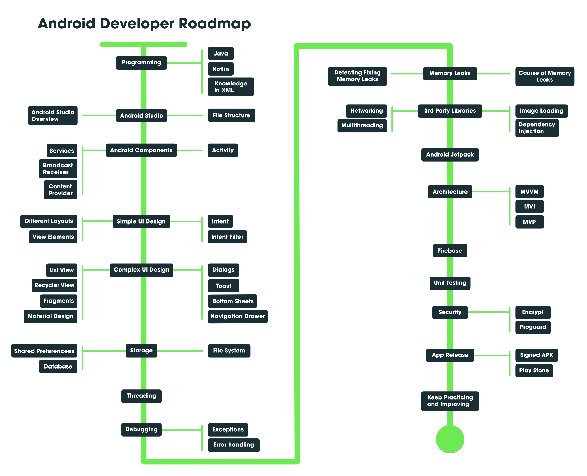

Please Navigate to the [_src_](/src) folder in this repository to find the .kt files.

Find the android Ebook [here](https://coding-blocks-ebooks.github.io/blocks-of-android/)

* The [**TicTacToe**](/TicTacToe) game was made during June'20 for Google Developers [_30 Days of Kotlin Campaign_](https://eventsonair.withgoogle.com/events/kotlin#) using this  [youtube tutorial](https://www.youtube.com/watch?v=Wekul3F8Zyk)

#### A complete Roadmap to become an Android-developer

